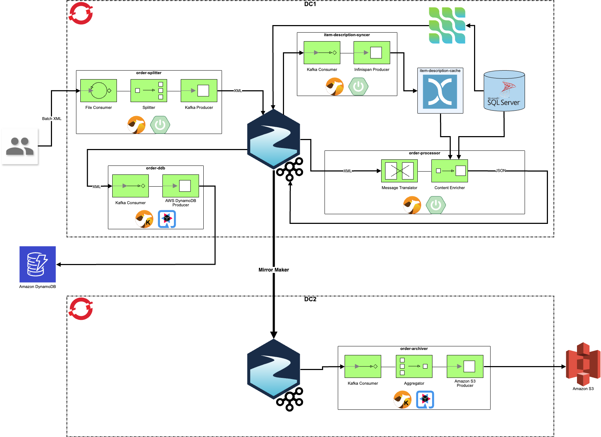

# Everything Everywhere All At Once Demo



## Pre-requisites

Install the AMQ Streams operator. This can be done within your target namespace(s) (ie, 'streams' & 'dc2-streams'), or globally across all namespaces.

Install the Prometheus operator. This can be done within your target namespace (ie, 'streams'), or globally across all namespaces.

Install the Grafana operator. This can be done within your target namespace (ie, 'streams'), or globally across all namespaces.

Install the Data Grid operator. This can be done within your target namespace (ie, 'datagrid'), or globally across all namespaces.

Install the Camel K operator. This can be done within your target namespace(s) (ie, 'camel' & 'dc2-camel'), or globally across all namespaces.

After installing the Camel K operator, you can download the `kamel` CLI for your platform via the OpenShift web console. Click on the  -> "Command Line Tools" link in the upper-right corner. Unzip the `kamel` CLI executable into the "${PROJECT_ROOT}/bin" directory.

## Set up DC1

__Environment__

```
#
# Set your env variables.
export PROJECT_ROOT="$(pwd)"
export PATH="${PROJECT_ROOT}/bin:${PATH}"

export DOMAIN="apps.cluster-rst4z.rst4z.sandbox1728.opentlc.com"
```

__Data Grid__

```
#
# Create/configure a Data Grid server.
cd "${PROJECT_ROOT}/datagrid"
oc new-project datagrid
oc -n datagrid apply -f ./infinispan-config.yaml
oc -n datagrid apply -f ./infinispan.yaml
oc -n datagrid apply -f ./item-description-cache.yaml
```

__Microsoft SQL Server__

```
#
# Create/configure a MS SQL Server database.
cd "${PROJECT_ROOT}/mssql"
oc new-project mssql
oc -n mssql apply -f ./mssql-data.yaml
oc -n mssql apply -f ./mssql-sql.yaml

# The following step must be completed as cluster-admin.
oc -n mssql adm policy add-scc-to-user anyuid -z default

oc -n mssql apply -f ./mssql-deployment.yaml
oc -n mssql apply -f ./mssql-service.yaml

oc -n mssql exec $(oc -n mssql get pods -l 'deployment=server' -o jsonpath='{.items[0].metadata.name}') -- /opt/mssql-tools/bin/sqlcmd -S localhost -U sa -P 'Abcd1234' -i /opt/workshop/mssql-sql.sql
```

__AMQ Streams__

```
#
# Create/configure the AMQ Streams cluster.
cd "${PROJECT_ROOT}/streams"
oc new-project streams
oc -n streams apply -f ./kafka-metrics-configmap.yaml
oc -n streams apply -f ./kafka-cluster.yaml
oc -n streams get secret dc1-cluster-cluster-ca-cert -o jsonpath='{.data.ca\.crt}' | base64 -d > ${PROJECT_ROOT}/tls/dc1-ca.crt
oc -n streams apply -f ./kafka-topics.yaml


#
# Create/configure the Debezium Kafka Connect cluster.
oc -n streams apply -f ./kafka-connect.yaml
oc -n streams apply -f ./kafka-connector-sqlserver-debezium.yaml


#
# Create/configure the Prometheus server. These steps must be completed as cluster-admin.
oc -n streams apply -f ./prometheus-additional-scrape-configmap.yaml
oc -n streams apply -f ./prometheus.yaml
oc -n streams apply -f ./prometheus-strimzi-pod-monitor.yaml


#
# Create/configure the Grafana server.
oc -n streams apply -f ./grafana.yaml
oc -n streams expose service grafana-service
oc -n streams apply -f ./grafana-datasource.yaml
oc -n streams apply -f './grafana-*-dashboard.yaml'
```

__Camel__

```
#
#
cd "${PROJECT_ROOT}/camel"
oc new-project camel
oc -n camel create configmap item-description-syncer-configmap --from-file=application.properties=./item-description-syncer/item-description-syncer-configmap.properties
kamel run -n camel --name item-description-syncer --config configmap:item-description-syncer-configmap ./item-description-syncer/ItemDescriptionSyncer.java

mvn clean install
pushd order-splitter; mvn -P openshift oc:deploy; popd
pushd order-processor; mvn -P openshift oc:deploy; popd

oc -n camel create configmap order-ddb-configmap --from-file=application.properties=./order-ddb/order-ddb-configmap.properties
oc -n camel create secret generic order-ddb-secret --from-file=application.properties=./order-ddb-secret.properties
kamel run -n camel --name order-ddb --config configmap:order-ddb-configmap --config secret:order-ddb-secret ./order-ddb/OrderDdb.java
```

## Set up DC2

__Environment__

```
#
# Set your env variables.
export DOMAIN="apps.cluster-rst4z.rst4z.sandbox1728.opentlc.com"
```

__AMQ Streams__

```
#
# Create/configure the AMQ Streams cluster.
cd "${PROJECT_ROOT}/dc2/streams"
oc new-project dc2-streams
oc -n dc2-streams apply -f ./kafka-cluster.yaml
oc -n dc2-streams create secret generic dc1-cluster-cluster-ca-cert --from-file=ca.crt=${PROJECT_ROOT}/tls/dc1-ca.crt
cat ./kafka-mirror-maker-2.yaml | envsubst | oc apply -f-
```

__Camel__

```
cd "${PROJECT_ROOT}/dc2/camel"
oc new-project dc2-camel
oc -n dc2-camel create configmap order-archiver-configmap --from-file=application.properties=./order-archiver/order-archiver-configmap.properties
oc -n dc2-camel create secret generic order-archiver-secret --from-file=application.properties=./order-archiver-secret.properties
kamel run -n dc2-camel --name order-archiver --config configmap:order-archiver-configmap --config secret:order-archiver-secret ./order-archiver/OrderArchiver.java
```

## Testing the code

Insert some item descriptions into the MS SQL Server DB.

```
oc -n mssql run server-client -ti --image=mcr.microsoft.com/mssql/server:2022-latest --rm=true --restart=Never -- /opt/mssql-tools/bin/sqlcmd -S server.mssql.svc -U sa -P 'Abcd1234'
```

```
use OrdersDB
go

insert into ItemDescription values ('1', 'Cogs')
insert into ItemDescription values ('2', 'Sprockets')
insert into ItemDescription values ('3', 'Ball Bearings')
insert into ItemDescription values ('4', 'Rotator Splints')
insert into ItemDescription values ('5', 'Doodads')
go

```

To upload order data you can use `curl` (as seen below), or you can use the upload form at "http://order-splitter-camel.${DOMAIN}/upload.html".

```
cd "${PROJECT_ROOT}/camel/order-splitter/src/test/data"
curl -X POST -F '@file=@./orders-01.xml' "http://order-splitter-camel.${DOMAIN}/camel/files/"
```

or

```
cd "${PROJECT_ROOT}/camel/order-splitter/src/test/data"
while true;
do
  export CUST_ID=$((1 + $RANDOM % 10));
	export ITEM_ID=$((1 + $RANDOM % 5));
	export QUANTITY=$((1 + $RANDOM % 100));
	ORDER_FILE="${TMPDIR}/orders.xml";
	cat ./orders-template.xml | envsubst > "${ORDER_FILE}";
  curl -X POST -F "@file=@${ORDER_FILE}" "http://order-splitter-camel.${DOMAIN}/camel/files/";
	rm "${ORDER_FILE}";
	sleep 1;
done;
```
